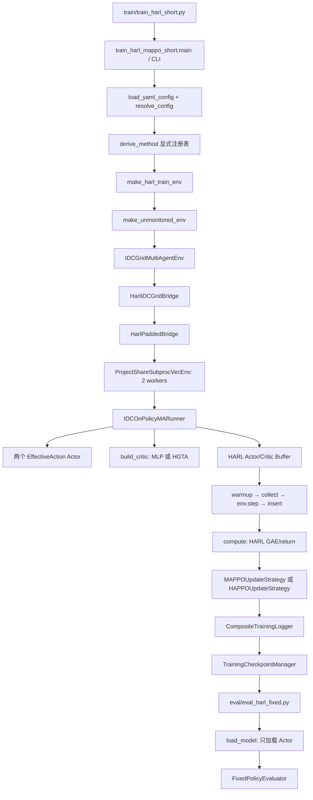

# 算法框架搭建——第十八部分：三种方法统一接口、公平性与短流程最终验收

审计时间：2026-07-29（Asia/Shanghai）  
项目：`C:\Users\bulio\Desktop\IDC\ultimate_simplify`  
项目 Git HEAD：`e3e77c487a1e59ed6d891e5ae34fe4732c580754`  
HARL：`C:\Users\bulio\Desktop\IDC\HARL`  
HARL Git HEAD：`050ad6a294fe9f7572985dea910d59ea6d4f94b4`

## 1. 最终结论

**第十八部分最终验收未通过，状态为公平性 Gate 阻塞。**

三种方法已确认共用环境、数据、观测、294 维集中状态、动作空间、有效动作 Mask、Reward、Actor 结构、Buffer、Runner、GAE、日志入口、Checkpoint 入口和固定评估入口；相同种子下三者的两个 Actor 初始参数逐元素完全一致，两个并行环境的构造状态、reset 输出与 reset 后状态也逐元素完全一致。

但是，已有同一代码版本、同一 seed=7110 的真实 1-update 产物表明：

- `MAPPO_MLP` 与 `HAPPO_MLP` 的更新前完整 48 步轨迹完全一致；
- `HAPPO_HGTA` 与两种 MLP 方法的更新前轨迹不一致；
- 两个 Actor 的动作张量共 2112 个元素全部不一致，最大绝对差为 `0.805418998003006`；
- action log-prob、Reward、48 步 step log 和 rollout 后环境状态随之不一致。

只读因果审计进一步确认：两个 Actor 构造结束后的 Torch RNG 状态三者相同；Critic 构造结束后，两个 MLP 方法仍相同，而 HGTA 方法不同。当前 Runner 在 Actor 后构造 Critic，并在 Critic 构造之后才进行首次随机动作采样，因此 HGTA 和 MLP Critic 对全局 Torch RNG 的不同消耗改变了首次 rollout 的探索随机流。

这不是环境、Reward、Actor 参数或日志问题，而是**Critic 构造随机流与 Actor 采样随机流未隔离**的公平性阻塞。

按本阶段规则，发现该问题后立即停止：没有启动三次 Part 18 全新 1-update 正式训练，没有执行其后恢复和固定 Actor 评估，不进行性能比较，也没有修改生产代码。

## 2. 三种方法契约

| 方法 | algorithm | critic_type | method_id | 当前注册状态 |
|---|---|---|---|---|
| 方法一 | `mappo` | `mlp` | `MAPPO_MLP` | 支持 |
| 方法二 | `happo` | `mlp` | `HAPPO_MLP` | 支持 |
| 方法三 | `happo` | `hgta` | `HAPPO_HGTA` | 支持 |
| 禁止组合 | `mappo` | `hgta` | `MAPPO_HGTA` | 未注册并明确抛出 `ValueError` |

`marl/methods/method_registry.py` 使用显式 `(algorithm, critic_type)` 注册，不从类名、文件名或实验名推断方法。只读审计得到禁止组合错误：

```text
ValueError: Unsupported algorithm/critic combination:
algorithm='mappo', critic_type='hgta'.
```

## 3. 统一调用路径



关键实现位置：

- CLI、配置和正式训练生命周期：`train/train_harl_mappo_short.py`；
- 环境工厂：`marl/envs/harl_env_factory.py`；
- Bridge/Padding：`marl/bridges/harl_bridge.py`、`marl/bridges/harl_padded_bridge.py`；
- 并行环境：`marl/envs/parallel_vec_env.py`；
- 统一 Runner：`marl/runners/idc_mappo_runner.py`；
- 更新策略：`marl/algorithms/update_strategy.py`；
- Critic 工厂：`marl/critics/critic_factory.py`；
- Checkpoint：`marl/checkpointing/training_checkpoint.py`；
- 固定评估：`eval/eval_harl_fixed.py`、`marl/evaluation/model_loader.py`、`marl/evaluation/evaluator.py`；
- HARL 的 warmup/collect/insert/compute/after_update：`HARL/harl/runners/on_policy_base_runner.py`；
- HARL MAPPO actor/critic 更新基线：`HARL/harl/runners/on_policy_ma_runner.py`。

## 4. 统一环境、状态、动作、Reward 与采样路径

| 契约项 | 三种方法共同值 | 审计结论 |
|---|---|---|
| 环境场景 | `idc_bess_padding` / `experiment_case=main` | 同一路径 |
| Agent 顺序 | `idc → bess` | 相同 |
| 真实局部观测 | IDC 288，BESS 164 | 相同 |
| Padding 后观测 | 288、288；BESS 末尾 124 维补零 | 相同 |
| 集中状态 | EP，294 维，对两个 Agent 重复 | 相同 |
| Padding 后动作 | 22、22 | 相同 |
| 有效动作 | IDC 22，BESS 1 | 相同 |
| BESS 环境执行动作 | 只取 padded action 第 0 维 | 相同 |
| BESS 虚拟动作 | 第 1～21 维 Mask 为 0 | 相同 |
| Reward | Bridge 原样按 Agent 顺序转换 | 相同 |
| 并行环境 | `ProjectShareSubprocVecEnv`，spawn，2 workers | 相同 |
| worker seeds | `7110, 8110` | 相同 |
| episode length | 24 | 相同 |
| rollout transitions | 24 × 2 = 48 | 相同数量 |
| GAE | `use_gae=true, gamma=0.99, gae_lambda=0.95` | 相同 |
| ValueNorm | `false` | 相同 |

`HarlPaddedBridge` 只做协议适配：BESS 观测补零；执行动作时仅切出第 0 维。它不裁剪动作、不改 Reward、不改变 294 维状态。

## 5. 配置差异审计

冻结的共同训练配置包括：

- seed `7110`；CPU；Torch/BLAS thread 均为 1；
- 2 rollout workers，worker seed stride `1000`，spawn；
- 1 update，24 steps/worker，共 48 transitions；
- Actor hidden sizes `[32, 32]`、ReLU、正交初始化、gain `0.01`；
- Actor/Critic learning rate 均为 `0.0005`；
- PPO epoch 与 critic epoch 均为 1；
- clip `0.2`、entropy coefficient `0.01`、max grad norm `10.0`；
- `gamma=0.99`、`gae_lambda=0.95`、Huber loss；
- `share_param=false`、`fixed_order=true`、`action_aggregation=prod`；
- 不启用 ValueNorm、线性学习率衰减、训练时 eval、render。

解析后的配置逐字段比较只出现预期差异：

| 比较 | 预期差异 |
|---|---|
| MAPPO_MLP vs HAPPO_MLP | algorithm、method id、algorithm implementation version、实验/输出标识 |
| HAPPO_MLP vs HAPPO_HGTA | critic type、method id、实验/输出标识 |
| MAPPO_MLP vs HAPPO_HGTA | 上述两类差异的并集 |

环境、数据、Reward、Actor、训练超参数、并行数、episode length 和 seed 没有额外差异。

## 6. 初始 Actor 与初始环境 Gate

### 6.1 Actor 初始参数

三种方法按正式构造顺序、相同 seed 独立重建。两个 Actor 的全部 `state_dict` 张量逐元素相同：

| Actor | 三种方法共同 SHA-256 | exact |
|---|---|---|
| IDC | `8db18f206e4745b9f051372a0f88d9e605cfdd89f97560d91770bd719b460a29` | 是 |
| BESS | `bafe67b84801897ddadc31d4d42fa5b0401f2219215b27818d8df0bf29ae1d7f` | 是 |

### 6.2 初始并行环境

三次独立构造生产 2-worker VecEnv。三组两两比较全部通过：

- reset 前完整可恢复环境状态 exact；
- reset 返回的 obs、share_obs、available_actions exact；
- reset 后完整可恢复环境状态 exact；
- worker seeds 均为 `[7110, 8110]`。

因此，初始 Actor 和初始环境不是轨迹差异来源。

## 7. 更新前完整 48 步轨迹 Gate

预检使用同一项目 Git HEAD 产生的三组既有真实 1-update 产物：

```text
runs/part16_mappo_mlp_zero_regression/.../seed-07110-2026-07-29-18-27-10
runs/part16_happo_mlp_zero_regression/.../seed-07110-2026-07-29-18-28-10
runs/part16_happo_hgta_smoke/.../seed-07110-2026-07-29-18-33-24
```

Checkpoint 的 `verification_state` 保存更新前 rollout 的完整 actions、action log-probs 和 critic rewards；step log 有 48 行，rollout 后环境状态也保存在 Checkpoint 中。

| 比较 | actions | log-probs | rewards | 48行 step log | rollout后环境 | 结论 |
|---|---:|---:|---:|---:|---:|---|
| MAPPO_MLP vs HAPPO_MLP | exact | exact | exact | exact | exact | 通过 |
| MAPPO_MLP vs HAPPO_HGTA | 不同 | 不同 | 不同 | 不同 | 不同 | 失败 |
| HAPPO_MLP vs HAPPO_HGTA | 不同 | 不同 | 不同 | 不同 | 不同 | 失败 |

HGTA 两组比较均为：

- action mismatch count：`2112 / 2112`；
- action max absolute difference：`0.805418998003006`。

**硬公平性 Gate 失败。**

## 8. 根因定位：模型构造共享采样 RNG

统一 Runner 的实际构造顺序是：

```text
set_seed
→ 构造 IDC Actor
→ 构造 BESS Actor
→ 构造 Critic（MLP 或 HGTA）
→ warmup / 首次随机动作采样
```

只读 RNG 审计结果：

| 边界 | MAPPO_MLP | HAPPO_MLP | HAPPO_HGTA |
|---|---|---|---|
| 两个 Actor 构造后 Torch RNG | `ef959c...daa9` | `ef959c...daa9` | `ef959c...daa9` |
| Critic 构造后 Torch RNG | `11b427...9210` | `11b427...9210` | `5c6a4b...194d` |

因此：

1. algorithm 类别本身没有改变初始 Actor 或初始采样 RNG；
2. MLP/HGTA Critic 的不同随机初始化消耗使全局 Torch RNG 在首次 rollout 前分叉；
3. stochastic Actor 采样使用该已经分叉的全局随机流；
4. 第一步动作不同后，环境状态、后续观测、Reward 和整条轨迹自然不同。

该问题不改变三种方法各自“能运行”的结论，但破坏了本阶段要求的“第一次更新前完整 48 步采样轨迹完全一致”，所以不能继续最终公平性验收，更不能开始性能比较。

## 9. 更新语义审计

虽然正式 Part 18 运行被停止，静态路径与既有 1-update Checkpoint 对更新语义的记录一致：

| 方法 | Actor 更新语义 | Critic |
|---|---|---|
| MAPPO_MLP | HARL MAPPO 独立更新两个 Actor；不使用 HAPPO factor；审计标识 `parallel_independent` | 294→MLP value |
| HAPPO_MLP | 固定顺序 IDC→BESS；factor 从全 1 开始；第二个 Agent 使用前一 Actor 更新后的乘积修正 | 294→MLP value |
| HAPPO_HGTA | 与 HAPPO_MLP 相同的固定顺序和 factor 语义 | 294→39节点/90有向边/7节点类/14关系类 HGTA value |

MAPPO 与 HAPPO 的预期算法差异被隔离在 `marl/algorithms/update_strategy.py`；MLP 与 HGTA 的预期 Critic 差异被隔离在 `marl/critics/critic_factory.py`。

## 10. 日志与 Checkpoint 格式审计

三组既有 1-update 产物均具有：

- `step_metrics.csv` 48 行；
- `episode_metrics.csv` 2 行；
- `update_metrics.csv` 1 行；
- 两个 Actor 模型文件；
- update 1 与 final Checkpoint/manifest；
- model、optimizer、normalizer、RNG、environment、runner、logger、verification、compatibility、provenance 状态；
- global step 48，episodes completed 2；
- 所有非有限/动作越界稳定性计数为 0。

三种方法使用同一日志与 Checkpoint schema。HGTA 仅额外带有预期的 graph metadata；MLP 的 graph metadata 为空。

## 11. Checkpoint 组合矩阵

对三份真实 Checkpoint 调用生产代码的 method metadata 校验函数，结果为严格对角矩阵：

| Checkpoint \ 当前方法 | MAPPO_MLP | HAPPO_MLP | HAPPO_HGTA |
|---|---:|---:|---:|
| MAPPO_MLP | 接受 | 明确拒绝 | 明确拒绝 |
| HAPPO_MLP | 明确拒绝 | 接受 | 明确拒绝 |
| HAPPO_HGTA | 明确拒绝 | 明确拒绝 | 接受 |

所有错误组合均抛出 `CheckpointCompatibilityError`，错误中同时列出 checkpoint 和 current 的 algorithm、critic type、method id、update order policy。

由于公平性 Gate 已触发停止条件，本阶段没有继续创建新的 load-only 运行目录；表中“接受”表示完整真实 Checkpoint 通过生产 method compatibility 校验，不等同于已执行新的 Part 18 环境/优化器全状态恢复流程。历史 Part 16/17 已分别验证过同构恢复能力。

## 12. 固定 Actor 评估审计

统一入口 `eval/eval_harl_fixed.py` 转发到算法中立的固定评估实现。`load_model` 从 run、checkpoint 或 model directory 读取 resolved config，显式推导 method，校验环境/动作/数据/Reward 指纹，然后只构造和加载两个 Actor；不会加载 Critic optimizer，也不会在评估时更新参数。

历史 Part 11/13/16/17 已覆盖三类 Actor 的固定评估能力。本阶段因公平性阻塞，没有对新的 Part 18 Checkpoint 执行固定 Actor 评估，因为这些新 Checkpoint 按规则没有产生。

## 13. 本阶段执行的只读测试

命令覆盖：

```text
test_unified_algorithm_interface.py
test_harl_bridge_shapes.py
test_bess_effective_action_mask.py
test_hgta_critic_interface.py
test_training_checkpoint_resume.py
test_fixed_evaluation.py
```

结果：`30 passed, 33 skipped`，exit 0。跳过项依赖测试夹具未提供的外部正式 artifact；没有失败。Pandapower 产生既有 deprecation warnings，pytest cache 因沙箱不可写产生 warning，均不影响结论。

## 14. 已执行与按规则停止的项目

| 项目 | 状态 |
|---|---|
| 统一入口/调用链审计 | 完成 |
| 环境、状态、动作、Reward、采样路径审计 | 完成 |
| 配置差异审计 | 完成 |
| 相同 seed Actor 初始参数 | 通过 |
| 相同 seed 初始环境状态 | 通过 |
| 更新前完整 48 步轨迹 | **失败** |
| 三次全新 Part 18 1-update | 未执行：停止条件触发 |
| 新 Checkpoint 实际恢复 | 未执行：停止条件触发 |
| 新固定 Actor 评估 | 未执行：停止条件触发 |
| 性能排名/短训练 Reward 比较 | 未执行：明确禁止 |
| 长训练/消融/调参 | 未执行：明确禁止 |

## 15. 代码冻结与新增审计产物

本阶段生产代码修改数量：**0**。

新增只读审计脚本：

```text
marl/tests/audit_three_methods_part18.py
SHA-256: 04C38539153497FBC2173F013674FC60F5D7E1AC48B3703EF3AD3E74DAAFBB63
```

新增机器可读证据：

```text
docs/dev_reports/part18_preflight_readonly_audit.json
SHA-256: B7C1965792F0E7E611C2F110908626429444AAC2101468C2608F680F6281D57A
```

审计脚本不调用优化器，不改训练 artifact；它只重建初始化、序列化环境状态、读取既有 Checkpoint/CSV 并输出 JSON。

工作区原有未提交变更与历史新增文件均保持原状，未被本阶段回退、覆盖或提交。

## 16. 阻塞分类与研究者决策点

阻塞类别：**实验公平性 / 随机流隔离**，不是训练数学正确性、环境物理链或数值稳定性错误。

在单独修复阶段可评估的方向包括：

1. 在模型初始化与 rollout 采样之间建立明确且与 Critic 类型无关的 Actor 采样 RNG 边界；或
2. 为 Actor stochastic sampling 使用独立、可保存恢复的 generator。

任何方案都必须同时验证：

- 不改变 Actor、Critic、GAE、Reward 和优化超参数；
- 三种方法首次 48 步 actions/log-probs/rewards/environment state bit-exact；
- Checkpoint 保存并恢复新增 RNG 状态；
- 连续训练与恢复仍精确；
- 不引入 `MAPPO_HGTA`。

本阶段不选择或实现修复方案，等待研究者单独授权。

## 17. 最终判定

当前框架已经实现三种方法的统一接口和绝大多数实验契约，但尚不能声称三种方法满足最终公平性要求。正式长训练与性能结论必须继续冻结，直到随机流隔离问题被单独修复，并重新执行本部分全部 Gate。

